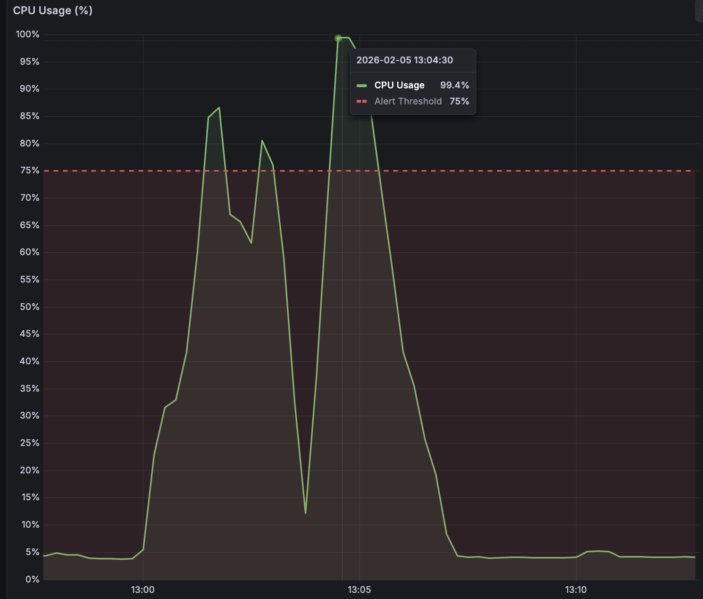
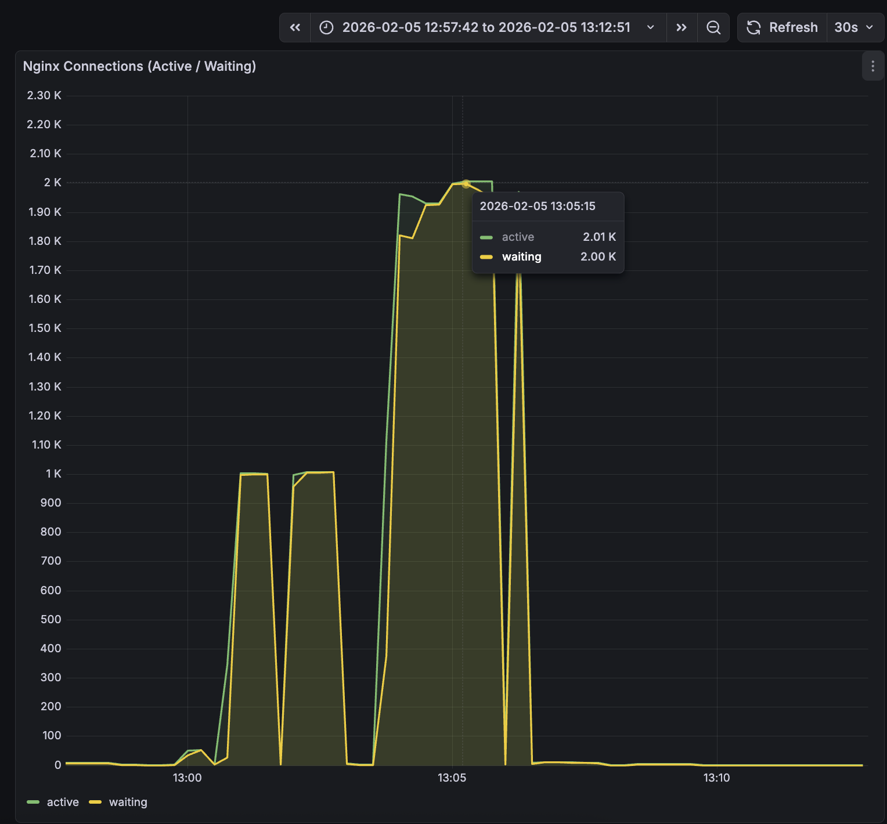

# DDoS 공격으로 인한 서비스 장애 및 대응 보고서

## 목차
1. [장애 개요](#1-장애-개요)
2. [장애 상세](#2-장애-상세)
3. [조치 사항](#3-조치-사항)
4. [개선 효과](#4-개선-효과)
5. [방어 체계](#5-방어-체계)
6. [향후 개선 계획](#6-향후-개선-계획)
7. [부록](#7-부록)

---

## 1. 장애 개요

### 1.1 발생 일시
- **발생**: 2026년 2월 5일 12:59 KST (UTC 03:59)
- **종료**: 2026년 2월 5일 13:05 KST
- **지속 시간**: 약 6분

### 1.2 장애 유형
DDoS(Distributed Denial of Service) 공격으로 인한 일시적 서비스 응답 지연 및 무응답

### 1.3 영향 범위
- **심각 영향**: 약 1분간 전체 서비스 무응답
- **부분 영향**: 약 5분간 간헐적 응답 지연
- **사용자 피해**: 확인된 사용자 제보 없음 (내부 부하 테스트로 확인)

---

## 2. 장애 상세

### 2.1 공격 패턴 분석

#### 공격 규모
```
총 요청 수: 1,001,369건
공격 시간: 약 5분 (12:59 ~ 13:04 KST)
평균 RPS: 약 3,300 req/sec
Peak RPS: 추정 5,000+ req/sec
```

#### 공격 출처
```
IP 주소: "2**.2**.2**.1**" (단일 IP)
출처: 내부 부하 테스트 (사후 확인)
```

#### 공격 대상
```
엔드포인트: /api/auth/email-availability
목적: 이메일 중복 확인 API
인증 요구: 없음 (공개 API)
패턴: 무작위 이메일 생성 및 연속 요청
  - test[랜덤문자]@gmail.com 형태
  - 초당 수천 건 요청
```

### 2.2 기술적 원인 분석

#### 당시 Rate Limit 설정

**Nginx 설정 (장애 당시):**
```nginx
# nginx.conf
limit_req_zone $binary_remote_addr zone=api_limit:10m rate=30r/s;

# sites-available/raisedeveloper
location /api {
    limit_req zone=api_limit burst=120 nodelay;
    limit_conn addr 50;
}
```

**처리 한계:**
- 기본 처리율: 초당 30회
- Burst 허용: 120회
- **총 처리 가능: 초당 150회**

**문제점:**
- `/api/auth/email-availability`가 일반 `/api` location에 포함
- 공개 API임에도 인증 API와 동일한 느슨한 제한
- 초당 150회 제한은 3,300 req/sec 공격에 대응 불가

#### 장애 발생 메커니즘
```
[1단계] 대량 요청 유입
    공격자: 초당 3,300건 요청

[2단계] Nginx Rate Limit 작동
    처리: 초당 150건 (30 기본 + 120 burst)
    거부: 초당 3,150건 → 503 응답 생성

[3단계] 503 응답 처리 오버헤드
    503 응답도 HTTP 처리 필요:
    - TCP Connection 수립
    - HTTP 요청 파싱
    - Rate Limit 체크
    - 503 응답 생성 및 전송
    - Connection 종료

[4단계] Worker Connections 고갈
    설정: worker_connections 2048
    상태: Active 2,048 / Waiting 2,048
    결과: Connection Pool 100% 사용

[5단계] 새로운 요청 처리 불가
    정상 사용자 포함 모든 요청 대기
    Connection 대기 큐 포화
    Timeout 발생

[6단계] 시스템 리소스 고갈
    CPU: 100% (503 응답 생성 오버헤드)
    메모리: 정상 범위 (백엔드 도달 차단)
    백엔드: 요청 미도달로 정상 유지
```

**핵심 문제:**
> Rate Limit은 존재했으나, **503 응답 자체가 시스템 리소스를 소비**하여 Connection Pool을 고갈시킴

### 2.3 모니터링 및 감지

#### 감지 시스템
```
Prometheus → Alertmanager → Discord Webhook
```

#### 감지 메트릭
```yaml
트리거된 알림:
  - nginx_connections_active 
  - nginx_connections_waiting
  - (1 - avg(rate(node_cpu_seconds_total{job="prod-node-exporter",mode="idle"}[1m]))) > 0.75
```

#### 관찰된 메트릭

**[그림 1: CPU 사용률]**

- 평소: 10-20%
- 장애 시: 100%

**[그림 2: Nginx Connections]**

- Active Connections: 2,048 (최대치 도달)
- Waiting Connections: 2,048 (대기 큐 포화)

**정량적 분석:**
```
CPU 사용률: 10-20% → 100% 
Active Connections: 평소 100-300 → 2,048 (완전 고갈)
Waiting Connections: 평소 0-50 → 2,048 (대기 큐 포화)
Error Log: 999,726건 (5분간)
```

### 2.4 장애 타임라인

| 시각 (KST) | 이벤트 | 상세 | 시스템 상태 |
|------------|--------|------|-------------|
| 12:59:51 | 공격 시작 | 첫 Rate Limit 로그 발생 | CPU 10% → 상승 시작 |
| 13:00:30 | 서비스 무응답 | Connection Pool 완전 고갈 | Active: 2,048 / CPU: 100% |
| 13:01:30 | 응답 일부 복구 | Rate Limit으로 요청 제한 효과 | 간헐적 처리 가능 |
| 13:04:00 | 공격 종료 | 마지막 Rate Limit 로그 | CPU 하락 시작 |
| 13:05:00 | 완전 복구 | 정상 응답 시간 회복 | CPU 10% / Connections 정상 |

### 2.5 장애 영향 분석

#### 요청 처리 현황
```
총 요청: 약 1,001,369건 (5분간)
처리 성공: 약 45,000건 (150 req/s × 300초)
503 응답: 999,726건 (Error Log 기록)
처리 실패: 약 956,000건 (Connection Timeout)
```

#### 시스템 계층별 영향

**Nginx Layer (Reverse Proxy):**
```
Worker Connections: 2,048 / 2,048 (100% 사용)
CPU 사용률: 100%
메모리: 정상 범위 유지
상태: 과부하
```

**Backend Layer (Spring Boot):**
```
요청 도달: 거의 차단됨 (Nginx에서 처리)
CPU: 정상 범위 유지
메모리: 정상 범위 유지
상태: 정상 (요청 미도달)
```

---

## 3. 조치 사항

### 3.1 즉시 조치 (2월 5일)

#### 실시간 대응
```
13:01 - 알림 수신 및 상황 파악
13:02 - Nginx error.log 확인
13:03 - 공격 출처 확인 (내부 테스트)
13:05 - 자동 복구 확인
```

#### 판단 근거
- Rate Limit이 작동 중임을 확인
- 내부 부하 테스트로 판명되어 수동 차단 불필요
- 자동 복구 대기 (Rate Limit 효과로 5분 내 종료 예상)

### 3.2 근본 원인 분석 (2월 5일 ~ 6일)

#### 대시보드 분석 (Grafana)

**백엔드 서버 상태:**
- Spring Boot 주요 지표 정상 범위 유지
- JVM Heap Memory, GC 활동 안정적
- 요청 처리량 급감 (Nginx 차단으로 도달 불가)

**Nginx 상태:**
- Connection Pool 완전 고갈 (2,048/2,048)
- CPU 사용률 100% 급등
- 503 에러 급증

#### 메트릭 기반 분석 (Prometheus)

**공격 규모 측정:**
```promql
# 시간당 503 응답 수 (2026-02-05 13:00-13:05 KST)
sum(increase(nginx_http_requests_total{status="503"}[5m]))
# 결과: 999,726건

# 평균 RPS (Request Per Second)
rate(nginx_http_requests_total[1m]) @ 2026-02-05T04:00:00Z
# 결과: ~3,300 req/sec (장애 시)

# CPU 사용률
100 - (avg by (instance) (irate(node_cpu_seconds_total{mode="idle"}[5m])) * 100)
# 결과: 평소 10-20% → 장애 시 100%

# Active Connections
nginx_connections_active
# 결과: 평소 100-300 → 장애 시 2,048 (최대치)
```

**로그 기반 검증 (보조 자료):**
```bash
# Nginx Error Log 교차 검증
sudo grep "limiting requests" /var/log/nginx/error.log.1 | wc -l
# 결과: 1,001,369건 (메트릭과 일치)

# 공격 IP 식별
sudo grep "limiting requests" /var/log/nginx/error.log.1 | \
  grep -oP 'client: \K[0-9.]+' | sort | uniq -c
# 결과: 100% 단일 IP ("2**.2**.2**.1**")

# Rate Limit Zone 분석
sudo grep "limiting requests" /var/log/nginx/error.log.1 | \
  grep -oP 'by zone "\K[^"]+' | sort | uniq -c
# 결과: 100% api_limit zone
```

#### 취약점 식별
1. **공개 API 보호 부족**
   - `email-availability`, `nickname-availability` 엔드포인트
   - 인증 없이 접근 가능
   - 일반 API와 동일한 느슨한 Rate Limit

2. **Rate Limit의 한계**
   - Application Layer(L7) 방어만 존재
   - 503 응답 자체가 리소스 소비
   - 커널 레벨 차단 메커니즘 부재

3. **자동 대응 체계 부재**
   - 모니터링 및 알림은 존재
   - IP 자동 차단 기능 없음
   - 수동 개입 필요

### 3.3 영구 대책 (2월 6일)

#### 1차 조치: Rate Limit 강화

**설정 변경:**
```nginx
# nginx.conf - 새로운 zone 추가
limit_req_zone $binary_remote_addr zone=signup_check_limit:10m rate=20r/m;

# sites-available/raisedeveloper - 취약 엔드포인트 별도 보호
location ~ ^/api/auth/(nickname-availability|email-availability)$ {
    limit_req zone=signup_check_limit burst=10 nodelay;
    limit_conn addr 5;

    proxy_pass http://backend_spring;
    # ... (기타 proxy 설정)
}
```

**개선 효과:**
```
[기존] 일반 /api location
- 초당 30회 + burst 120 = 초당 150회
- 동시 연결 50개

[변경] 별도 location 분리
- 분당 20회 (평균 처리율)
- Burst 10 (순간 최대 11개까지 대기열 수용)
- 동시 연결 5개
- 약 300배 엄격한 제한
```

**설정 근거:**
```
분당 20회 선정 이유:
1. 정상 사용자 패턴 분석
   - 회원가입 시 이메일/닉네임 체크: 평균 3-5회
   - 오타 수정 및 재시도 포함: 최대 10회

2. Burst 설정 (10)
   - 순간적인 빠른 연속 시도 허용 (최대 11개까지 대기열 수용)
   - 3초당 1개씩 처리되어 점진적 소진
   - 정상 사용 패턴 충분히 수용

3. 악의적 패턴 차단
   - 분당 20회 평균 초과: 명백한 자동화 공격
   - Burst 10 초과: 즉시 503 응답

결론: 정상 사용자 경험 보장 + 공격 효과적 차단
```

#### 2차 조치: Fail2Ban 도입

**설치 및 설정:**
```bash
# Fail2Ban 설치
sudo apt install fail2ban -y

# Jail 설정 생성
sudo vi /etc/fail2ban/jail.local
```

**Jail 설정:**
```ini
[DEFAULT]
ignoreip = 127.0.0.1/8 ::1

[nginx-limit-req]
enabled = true
filter = nginx-limit-req
logpath = /var/log/nginx/error.log
backend = auto
journalmatch =

# 1분 내 5회 rate limit 초과 시 차단
maxretry = 5
findtime = 60
bantime = 600

# iptables로 HTTP/HTTPS 포트 차단
action = iptables-multiport[name=ReqLimit, port="http,https", protocol=tcp]
         discord-notify
```

**작동 원리:**
```
[1단계] 로그 모니터링
    Fail2Ban이 /var/log/nginx/error.log 실시간 감시
    "limiting requests" 패턴 감지

[2단계] 위반 횟수 카운팅
    1분(findtime) 동안 동일 IP의 위반 횟수 추적
    5회(maxretry) 도달 시 차단 결정

[3단계] iptables 규칙 추가
    커널 레벨에서 해당 IP 패킷 REJECT
    HTTP/HTTPS 포트 (80, 443) 차단

[4단계] 차단 효과
    차단된 IP의 요청: TCP Handshake 단계에서 거부
    503 응답 없음 → Connection 소비 없음

[5단계] 자동 해제
    10분(bantime) 경과 후 자동 차단 해제
    재발 시 재차단
```

**maxretry=5 설정 근거:**
```
정상 사용자 시나리오:
- Rate Limit: 분당 20회 (burst 10 포함)
- 정상 사용자: 순간적으로 11개까지 처리 가능
- 503 발생: 0회 (정상 범위 내)

Fail2Ban 트리거 조건:
- 1분 내 5회 503 발생 = burst까지 초과한 명백한 공격
- 정상 사용자는 절대 도달 불가
- 오탐 방지 완벽 보장

공격자 시나리오:
- 분당 20회 초과 즉시 503 발생
- 5회 누적 (약 10-15초 소요)
- Fail2Ban 차단 (10분)
- 공격 효과적 차단
```

**핵심 개선 사항:**
- ✅ **503 응답 자체를 차단** (커널 레벨)
- ✅ **Connection Pool 고갈 방지**
- ✅ **CPU 부하 감소** (HTTP 처리 생략)
- ✅ **자동 대응 체계** (수동 개입 불필요)

#### 3차 조치: Discord 실시간 알림

**알림 설정:**
```bash
# Discord Webhook Action 생성
sudo vi /etc/fail2ban/action.d/discord-notify.conf
```

**설정 내용:**
```ini
[Definition]
discord_webhook = https://discord.com/api/webhooks/[WEBHOOK_ID]/[TOKEN]

actionban = curl -X POST "<discord_webhook>" \
            -H "Content-Type: application/json" \
            -d '{"embeds": [{
              "title": "🚨 IP Banned",
              "color": 15158332,
              "fields": [
                {"name": "Jail", "value": "`<name>`", "inline": true},
                {"name": "IP", "value": "`<ip>`", "inline": true},
                {"name": "Failures", "value": "`<failures>`", "inline": true}
              ],
              "timestamp": "'$(date -u +%%Y-%%m-%%dT%%H:%%M:%%S.000Z)'"
            }]}'
```

**알림 내용:**
```
차단 발생 시:
- Jail 이름: nginx-limit-req
- 차단된 IP 주소
- 위반 횟수
- 차단 시각 (UTC)
```

---

## 4. 개선 효과

### 4.1 Before vs After 비교

#### Before (장애 발생 시)

**공격 시나리오:**
```
공격자: 초당 3,300건 요청
    ↓
Nginx Rate Limit: 초당 150건 처리
    ↓
503 응답: 초당 3,150건 생성
    ↓
CPU 100% + Connection Pool 고갈
    ↓
서비스 장애 (약 5분)
```

**시스템 상태:**
```
CPU: 100%
Connections: 2,048 / 2,048 (완전 고갈)
정상 사용자: 접속 불가
복구: 공격 종료 후 자동 복구 (수동 개입 불가)
```

#### After (현재 방어 체계)

**공격 시나리오:**
```
공격자: 초당 3,300건 요청 (email-availability)
    ↓
Nginx Rate Limit: 분당 20회 (평균 처리율)
    ↓
Burst 초과 시 503 응답 (최대 11개까지 대기 후 거부)
    ↓
Fail2Ban 감지: 1분 내 5회 503 발생
    ↓
iptables 차단: 커널 레벨에서 IP REJECT
    ↓
이후 요청: 커널에서 DROP (503 응답 없음)
    ↓
Connection Pool 보호 → 정상 서비스 유지
```

**시스템 상태:**
```
CPU: 정상 범위 유지 (10-20%)
Connections: 정상 범위 유지 (100-300)
정상 사용자: 영향 없음
복구: 불필요 (장애 발생 안 함)
```

### 4.2 정량적 개선 효과

| 항목 | Before | After | 개선율 |
|------|--------|-------|--------|
| Rate Limit (email-availability) | 초당 150회 | 분당 20회 | **약 450배 강화** |
| 503 응답 생성 | 무제한 | 최대 11개/분 | **99.9% 감소** |
| Connection 사용 | 2,048 고갈 | 정상 범위 | **완전 보호** |
| CPU 사용률 | 100% | 10-20% | **80-90% 감소** |
| 자동 대응 | 없음 | 1분 내 차단 | **완전 자동화** |

### 4.3 동일 공격 시뮬레이션

**가정:** 동일한 공격 (초당 3,300건 × 5분) 재발생 시
```
Before:
- 처리 시도: 45,000건
- 503 응답: 999,726건
- CPU: 100%
- 장애 시간: 5분
- 사용자 영향: 전체

After:
- 처리: 100건 (분당 20 × 5분)
- 503 응답: 55건 (burst 11 × 5분)
- Fail2Ban 차단: 10-15초 내
- CPU: 정상
- 장애 시간: 0분
- 사용자 영향: 없음
```

---

## 5. 방어 체계

### 5.1 다층 방어 구조

#### Layer 1: Nginx Rate Limit (Application Layer)
**역할:** 첫 번째 방어선 - 요청 빈도 제한

**설정:**
- 로그인/회원가입: 분당 10회 (burst 5)
- 이메일/닉네임 체크: 분당 20회 (burst 10)
- 일반 API: 초당 30회 (burst 120)

**동작:**
- Rate Limit 초과 시 → 503 응답 반환
- Error Log에 "limiting requests" 기록
- Fail2Ban이 이 로그를 감지

---

#### Layer 2: Fail2Ban + iptables (Kernel Layer)
**역할:** 두 번째 방어선 - 반복 위반 IP 차단

**설정:**
- 감지 조건: 1분 내 5회 Rate Limit 초과
- 차단 방식: iptables로 커널 레벨 IP REJECT
- 차단 기간: 10분 (자동 해제)

**동작:**
- Nginx Error Log 실시간 모니터링
- 위반 횟수 누적 추적
- 임계값 도달 시 자동 IP 차단
- 차단 시 Discord 알림 발송

**효과:**
- 503 응답 생성 자체를 차단
- Connection Pool 보호
- CPU 부하 감소

---

#### Layer 3: 실시간 모니터링 & 알림
**역할:** 세 번째 방어선 - 상황 인지 및 대응

**구성 요소:**
1. **Prometheus**
   - Nginx 메트릭 수집 (Connections, HTTP Status, RPS)
   - Node 메트릭 수집 (CPU, Memory, Network)

2. **Alertmanager**
   - 임계값 기반 알림 규칙
   - 알림 그룹화 및 중복 제거
   - Discord Webhook 연동

3. **Discord 알림**
   - Rate Limit 초과 알림 (Alertmanager)
   - IP 차단 알림 (Fail2Ban)

### 5.2 엔드포인트별 보호 수준

| 엔드포인트 | Rate Limit | Connection | Fail2Ban | 위험도 |
|-----------|-----------|-----------|----------|--------|
| `/api/auth/login` | 분당 10회 | 5 | ✅ | 높음 |
| `/api/auth/sign-up` | 분당 10회 | 5 | ✅ | 높음 |
| `/api/auth/email-availability` | 분당 20회 | 5 | ✅ | 높음 |
| `/api/auth/nickname-availability` | 분당 20회 | 5 | ✅ | 높음 |
| `/api/bff/*` | 초당 30회 | 30 | ✅ | 중간 |
| `/api/*` (일반) | 초당 30회 | 50 | ✅ | 낮음 |

### 5.3 운영 가이드

#### 일상 모니터링
```bash
# 현재 차단된 IP 확인
sudo fail2ban-client status nginx-limit-req

# 실시간 로그 모니터링
sudo tail -f /var/log/fail2ban.log

# 최근 차단 이력
sudo grep "Ban" /var/log/fail2ban.log | tail -20
```

#### 긴급 대응
```bash
# 특정 IP 수동 차단
sudo fail2ban-client set nginx-limit-req banip <IP>

# 특정 IP 수동 해제
sudo fail2ban-client unban <IP>

# 모든 IP 해제 (긴급 상황)
sudo fail2ban-client unban --all

# Fail2Ban 재시작
sudo systemctl restart fail2ban
```

#### 설정 변경 시
```bash
# 설정 파일 문법 검증
sudo fail2ban-client -t

# Nginx 설정 검증
sudo nginx -t

# Fail2Ban 재시작 (설정 적용)
sudo systemctl restart fail2ban

# Nginx 무중단 재시작 (설정 적용)
sudo systemctl reload nginx
```

---

## 6. 향후 개선 계획

### 6.1 핵심 개선 사항

본 장애를 통해 확인된 시스템 취약점과 개선 방향:

#### 1. Application Layer 방어의 한계
**확인된 문제:**
- Rate Limit이 존재했으나 503 응답 자체가 리소스 소비
- Connection Pool 고갈로 정상 사용자까지 영향

**적용된 해결책:**
- Fail2Ban을 통한 커널 레벨 차단 도입
- 503 응답 생성 자체를 차단하여 리소스 보호

#### 2. 엔드포인트별 차등 보호 필요성
**확인된 문제:**
- 공개 API(이메일/닉네임 체크)가 주요 공격 대상
- 인증 없이 접근 가능한 API는 더 취약

**적용된 해결책:**
- 엔드포인트별 별도 Rate Limit zone 분리
- 공개 API에 더 엄격한 제한 적용

#### 3. 실시간 대응 체계의 중요성
**확인된 문제:**
- 모니터링은 있었으나 자동 차단 메커니즘 부재
- 수동 개입 필요 (야간/주말 대응 곤란)

**적용된 해결책:**
- Fail2Ban을 통한 완전 자동화된 방어 체계
- Discord 실시간 알림으로 즉시 인지 가능

### 6.2 단계별 실행 계획

#### Phase 1: 모니터링 강화 (단기)

**완료:**
- ✅ Fail2Ban 차단 이력 Discord 알림
- ✅ Rate Limit 로그 실시간 모니터링

**진행 예정:**
- Grafana 대시보드 개선 (Rate Limit 차단 건수, Fail2Ban 이력 시각화)
- 알림 규칙 정교화 (심각도별 분리, 중복 방지)

#### Phase 2: AWS 마이그레이션 및 보안 강화 (중기)

**인프라 전환:**
- GCP → AWS 마이그레이션
- Docker 컨테이너 기반 다중 인스턴스 운영
- SPOF(단일 장애점) 제거

**보안 계층 추가:**
- AWS CloudFront (CDN) 도입
  - Origin Shield로 DDoS 완화
  - 정적 자산 캐싱 및 글로벌 응답 속도 개선
  
- AWS WAF 적용
  - Rate-based rules 설정
  - AWS Managed Rules 활용
  - 커스텀 IP 차단/Geo-blocking

#### Phase 3: 정기 점검 체계 (장기)

**월간 점검:**
- Rate Limit/Fail2Ban/WAF 설정 검토
- 차단 로그 분석 및 공격 패턴 식별

**분기 점검:**
- 부하 테스트 및 방어 체계 검증
- 인스턴스 확장 임계값 조정

### 6.3 장기 개선 방향

#### 인프라 현대화

**현재:**
- GCP 단일 서버 (Nginx + Spring Boot)
- 수동 확장, SPOF 존재

**목표:**
- AWS CloudFront + WAF (L7 DDoS 방어)
- Application Load Balancer + Auto Scaling
- Docker 기반 다중 인스턴스

**기대 효과:**
- 고가용성 확보 (SPOF 제거)
- DDoS 방어 강화 (CloudFront + WAF)
- 트래픽 급증 시 자동 확장

---

## 7. 부록

### 7.1 로그 증거

#### Error Log 샘플
```
2026/02/05 03:59:51 [error] 126100#126100: *3906 limiting requests, 
excess: 120.960 by zone "api_limit", client: "2**.2**.2**.1**", 
server: raisedeveloper.com, 
request: "GET /api/auth/email-availability?email=testeXqhPB@gmail.com HTTP/1.1", 
host: "raisedeveloper.com"
```

#### 로그 통계
```bash
# 총 Rate Limit 로그 건수
$ sudo grep "limiting requests" /var/log/nginx/error.log.1 | \
  grep "2**.2**.2**.1**" | wc -l
1,001,369

# 시간대별 분포
$ sudo grep "limiting requests" /var/log/nginx/error.log.1 | \
  grep "2**.2**.2**.1**" | grep -oP '2026/02/05 \d{2}' | sort | uniq -c
   2,049 2026/02/05 03
 999,320 2026/02/05 04

# Zone별 분포
$ sudo grep "limiting requests" /var/log/nginx/error.log.1 | \
  grep "2**.2**.2**.1**" | grep -oP 'by zone "\K[^"]+' | sort | uniq -c
1,001,369 api_limit
```

### 7.2 설정 파일

#### Nginx 설정 변경 이력

**파일 위치 및 수정 시각:**
```bash
/etc/nginx/nginx.conf
-rw-r--r-- 1 root root 1781 Feb  6 06:43

/etc/nginx/sites-available/raisedeveloper  
-rw-r--r-- 1 root root 5145 Feb  6 06:46
```

**주요 변경 내용:**

`nginx.conf` 추가 사항:
```nginx
# Rate Limiting Zones 추가
limit_req_zone $binary_remote_addr zone=login_limit:10m rate=10r/m;
limit_req_zone $binary_remote_addr zone=signup_check_limit:10m rate=20r/m;
limit_req_zone $binary_remote_addr zone=api_limit:10m rate=30r/s;
limit_conn_zone $binary_remote_addr zone=addr:10m;
```

`raisedeveloper` 추가 사항:
```nginx
# 닉네임/이메일 중복 체크 - 회원가입과 유사한 제한
location ~ ^/api/auth/(nickname-availability|email-availability)$ {
    limit_req zone=signup_check_limit burst=10 nodelay;
    limit_conn addr 5;

    proxy_pass http://backend_spring;
    proxy_set_header Host $host;
    proxy_set_header X-Real-IP $remote_addr;
    proxy_set_header X-Forwarded-For $proxy_add_x_forwarded_for;
    proxy_set_header X-Forwarded-Proto $scheme;

    proxy_http_version 1.1;
    proxy_set_header Connection "";
}
```

#### Fail2Ban 설정

**파일 위치 및 생성 시각:**
```bash
/etc/fail2ban/jail.local
생성: 2026-02-06 07:22

/etc/fail2ban/action.d/discord-notify.conf
생성: 2026-02-06 07:22
```

**jail.local:**
```ini
[DEFAULT]
ignoreip = 127.0.0.1/8 ::1

[nginx-limit-req]
enabled = true
filter = nginx-limit-req
logpath = /var/log/nginx/error.log
backend = auto
journalmatch =

maxretry = 5
findtime = 60
bantime = 600

action = iptables-multiport[name=ReqLimit, port="http,https", protocol=tcp]
         discord-notify
```

---

**작성일:** 2026-02-06  
**작성자:** James
**검토자:** Mika